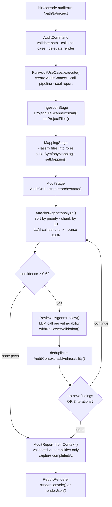
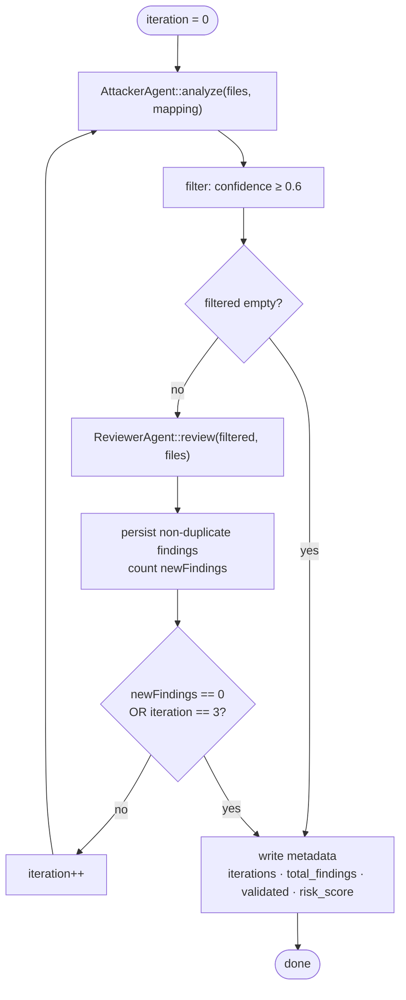

# Architecture

This document describes the internal design of the `symfony-security-auditor`
Symfony bundle for contributors and integrators. It covers layer
responsibilities, data flow, key design decisions, and extension points.

## Table of Contents

- [Layer Overview](#layer-overview)
- [Data Flow](#data-flow)
- [Domain Layer](#domain-layer)
  - [`AuditContext`](#auditcontext--mutable-pipeline-accumulator)
  - [`AuditReport`](#auditreport--immutable-final-snapshot)
  - [`Vulnerability`](#vulnerability--immutable-copy-on-write-mutations)
  - [`VulnerabilitySeverity`](#vulnerabilityseverity--backed-enum)
  - [`VulnerabilityType`](#vulnerabilitytype--backed-enum-with-owasp-references)
  - [`ProjectFile`](#projectfile--immutable-scanned-file)
  - [`SymfonyMapping`](#symfonymapping--immutable-project-structure-snapshot)
  - [Pipeline ports](#pipeline-ports-domainpipeline)
- [Application Layer](#application-layer)
  - [`RunAuditUseCase`](#runauditusecase)
  - [`AuditPipeline`](#auditpipeline)
  - [Stages](#stages)
  - [`AuditOrchestrator`](#auditorchestrator)
  - [`AttackerAgent`](#attackeragent)
  - [`ReviewerAgent`](#revieweragent)
  - [`VulnerabilityFactory`](#vulnerabilityfactory)
- [Infrastructure Layer](#infrastructure-layer)
- [Bundle Wiring](#bundle-wiring-symfonysecurityauditorbundle)
- [`Command/AuditCommand`](#commandauditcommand)
- [Extension Points](#extension-points)

> See also: [Configuration](configuration.md) · [Extending](extending.md) ·
> [FAQ](faq.md) · [Troubleshooting](troubleshooting.md)

---

## Layer Overview

The bundle follows a strict Domain-Driven Design layering under `src/Audit/`.
Infrastructure dependencies never leak into the Domain or Application layers.

```text
src/
├── Audit/
│   ├── Domain/          # Pure PHP — no framework, no I/O
│   │   ├── Model/       # Value objects and enums
│   │   ├── Pipeline/    # PipelineInterface, StageInterface, CoverageRecorderInterface, NullCoverageRecorder
│   │   └── Port/        # Cross-layer ports — LLMClientInterface, LLMResponse,
│   │       │              AttackerCacheInterface, ProjectFileScannerInterface,
│   │       │              Attacker/ReviewerPromptBuilderInterface
│   │       └── Tool/    # ToolInterface, ToolDefinition, ToolRegistry, ToolRegistryFactoryInterface
│   ├── Application/     # Orchestration — no I/O, depends only on Domain
│   │   ├── UseCase/     # Entry point: RunAuditUseCase
│   │   ├── Pipeline/    # AuditPipeline + three Stage implementations
│   │   └── Agent/       # Attacker/Reviewer agents (+ interfaces), AuditOrchestrator (+ interface), VulnerabilityFactory
│   └── Infrastructure/  # I/O adapters
│       ├── LLM/         # SymfonyAiLLMClient (implements Domain/Port/LLMClientInterface)
│       ├── FileSystem/  # ProjectFileScanner
│       ├── Prompt/      # AttackerPromptBuilder, ReviewerPromptBuilder
│       ├── Cache/       # FilesystemAttackerCache, NullAttackerCache
│       ├── Advisory/    # ComposerAuditAdvisoryDatabase (default), InMemoryAdvisoryDatabase,
│       │                  SymfonyProcessComposerAuditRunner + Exception/*
│       ├── Tool/        # ReadFileTool, GrepTool, ListFilesTool, LookupAdvisoryTool,
│       │                  SymfonyToolRegistryFactory
│       └── Report/      # ReportRenderer (console / JSON / SARIF + Template/*.txt)
├── Command/             # AuditCommand + AuditCommandInput, AuditPresenter, ReportWriter, AuditExitCodeResolver, OutputFormat
└── SymfonySecurityAuditorBundle.php  # Bundle class with configure() + loadExtension()
```



```mermaid
graph LR
    CMD["Command\nAuditCommand"]

    subgraph APP["Application"]
        UC["RunAuditUseCase"]
        PIPE["AuditPipeline + Stages"]
        AGENTS["AttackerAgent\nReviewerAgent"]
    end

    subgraph DOM["Domain"]
        MODELS["AuditContext · AuditReport\nVulnerability · ProjectFile\nSymfonyMapping"]
        PORTS["PipelineInterface · StageInterface\nLLMClientInterface · LLMResponse\nAttackerCacheInterface\nProjectFileScannerInterface\n*PromptBuilderInterface\nTool/* (ports)"]
    end

    subgraph INFRA["Infrastructure"]
        LLM["SymfonyAiLLMClient"]
        FS["ProjectFileScanner"]
        PROMPTS["PromptBuilders"]
        CACHE["FilesystemAttackerCache · NullAttackerCache"]
        ADVISORY["ComposerAuditAdvisoryDatabase\nInMemoryAdvisoryDatabase\nSymfonyProcessComposerAuditRunner"]
        TOOLS["ReadFile · Grep · ListFiles · LookupAdvisory tools\nSymfonyToolRegistryFactory"]
        RENDERER["ReportRenderer"]
    end

    CMD --> APP
    APP --> DOM
    INFRA -.->|implements| DOM
    APP -->|via interface| INFRA
```

**Namespace root**: `VinceAmstoutz\SymfonySecurityAuditor\`

---

## Data Flow



---

## Domain Layer

### `AuditContext` — mutable pipeline accumulator

`AuditContext` is the single shared object threaded through every pipeline
stage. It is intentionally mutable: stages write to it; the use case reads the
final state.

```text
AuditContext {
  projectPath: string           (immutable, set at construction)
  auditId: string               (immutable, generated: AUDIT-{8hex})
  startedAt: DateTimeImmutable  (immutable, set at construction)
  projectFiles: list<ProjectFile>   (set by IngestionStage)
  mapping: SymfonyMapping|null      (set by MappingStage)
  vulnerabilities: array<id, Vulnerability>  (accumulated by AuditStage)
  metadata: array<string, mixed>    (arbitrary stage metadata)
}
```

Key computed reads:

- `validatedVulnerabilities()` — filters by `isReviewerValidated() === true`
- `criticalVulnerabilities()` — filters validated + `CRITICAL` severity
- `riskScore()` — sum of `severity->score()` over validated vulnerabilities

### `AuditReport` — immutable final snapshot

Created exactly once via `AuditReport::fromContext(AuditContext)` after the
pipeline finishes. It captures only `validatedVulnerabilities()` — unvalidated
attacker findings are discarded.

```text
AuditReport {
  auditId, projectPath, startedAt, completedAt, filesScanned
  vulnerabilities: list<Vulnerability>   (validated only)
}
```

Computed methods: `riskScore()`, `riskLevel()` (SAFE / LOW / MEDIUM / HIGH /
CRITICAL), `durationSeconds()`, `vulnerabilitiesBySeverity()`,
`vulnerabilitiesByType()`, `toArray()`.

Risk level thresholds (based on summed severity scores):

| Score | Level    |
| ----- | -------- |
| >= 50 | CRITICAL |
| >= 30 | HIGH     |
| >= 15 | MEDIUM   |
| >= 5  | LOW      |
| < 5   | SAFE     |

### `Vulnerability` — immutable, copy-on-write mutations

All properties are `readonly`. State changes return new instances:

- `withReviewerValidation(bool): self` — called by `ReviewerAgent`
- `withElevatedSeverity(VulnerabilitySeverity): self` — called when reviewer
  adjusts severity

The `id` is deterministic:
`VULN-{sha1(type+filePath+lineStart+microtime)[0..7]}`.

Fields: `id`, `type` (enum), `severity` (enum), `title`, `description`,
`filePath`, `lineStart`, `lineEnd`, `vulnerableCode`, `attackVector`, `proof`,
`remediation`, `confidence` (0.0–1.0), `reviewerValidated`, `detectedAt`.

### `VulnerabilitySeverity` — backed enum

| Case     | Score | `isExploitable()` |
| -------- | ----- | ----------------- |
| CRITICAL | 10    | true              |
| HIGH     | 7     | true              |
| MEDIUM   | 5     | false             |
| LOW      | 2     | false             |
| INFO     | 0     | false             |

`score()` drives the risk calculation. `isExploitable()` is used by
`Vulnerability::isHighRisk()`.

### `VulnerabilityType` — backed enum with OWASP references

32 cases in six categories:

| Category              | Examples                                                                   |
| --------------------- | -------------------------------------------------------------------------- |
| Injection             | `SQL_INJECTION`, `COMMAND_INJECTION`, `TWIG_INJECTION`, …                  |
| Broken Access Control | `BROKEN_ACCESS_CONTROL`, `MISSING_VOTER`, `MISSING_CSRF_PROTECTION`, …     |
| Logic Flaw            | `BUSINESS_LOGIC_FLAW`, `RACE_CONDITION`, `STATE_MACHINE_BYPASS`, …         |
| Symfony-Specific      | `MASS_ASSIGNMENT`, `UNSAFE_PARAMETER_BINDING`, `MISCONFIGURED_FIREWALL`, … |
| Data Exposure         | `SENSITIVE_DATA_EXPOSURE`, `PATH_TRAVERSAL`, `SSRF`, `XXE`, …              |
| Cryptographic         | `WEAK_CRYPTOGRAPHY`, `HARDCODED_SECRET`, `INSECURE_RANDOM`                 |

`category()` and `owaspReference()` return human-readable strings used in report
output and LLM prompts.

### `ProjectFile` — immutable scanned file

Holds `relativePath`, `absolutePath`, `content`, `type` (auto-detected string),
`linesCount`. Classification methods (`isController()`, `isEntity()`,
`isVoter()`, `isRepository()`, `isForm()`, `isService()`, `isTemplate()`,
`isConfiguration()`) drive both `SymfonyMapping` construction and
`AttackerAgent` chunking priority.

### `SymfonyMapping` — immutable project structure snapshot

Groups `ProjectFile` instances by role and holds `routeAccessMap` and
`firewallRules`. Passed to `AttackerAgent` so it can reason about the full
security surface rather than file contents alone. Notable helper:
`controllersWithoutVoters()` surfaces controllers that lack `#[IsGranted]` or
`denyAccessUnlessGranted` calls.

### Pipeline ports (`Domain/Pipeline/`)

- `PipelineInterface::process(AuditContext): void`
- `StageInterface::process(AuditContext): void` + `name(): string`

Both are pure domain ports. Concrete implementations live in
`Application/Pipeline/`.

---

## Application Layer

### `RunAuditUseCase`

Single public method: `execute(string $projectPath): AuditReport`. Owns the
lifecycle: creates `AuditContext`, delegates to `AuditPipeline`, seals
`AuditReport`. No I/O, no LLM calls — those are behind interfaces injected into
the stages.

### `AuditPipeline`

Ordered stage container. Stages are added via `addStage(StageInterface)` (wired
by the extension). Logs stage name and elapsed time per stage.

### Stages

**`IngestionStage`** — calls `ProjectFileScanner::scan(string $projectPath)`,
calls `AuditContext::setProjectFiles()`.

**`MappingStage`** — classifies `AuditContext::projectFiles()` into roles,
constructs `SymfonyMapping`, calls `AuditContext::setMapping()`. May use the LLM
client for semantic mapping or fall back to heuristic classification.

**`AuditStage`** — delegates entirely to
`AuditOrchestrator::orchestrate(AuditContext)`.

### `AuditOrchestrator`

Implements the attacker-vs-reviewer loop:



Duplicate detection: two vulnerabilities are duplicates when their IDs match, or
when `filePath`, `type`, and line ranges all overlap.

### `AttackerAgent`

Sorts files by security priority before chunking:

| Priority | File type       |
| -------- | --------------- |
| 0        | Controllers     |
| 1        | Voters          |
| 2        | Entities        |
| 3        | Repositories    |
| 4        | Forms           |
| 5        | Everything else |

Chunks sorted list into groups of 10 (`CHUNK_SIZE`). For each chunk: builds
prompts via `AttackerPromptBuilder`, then either calls
`LLMClientInterface::complete()` (single-shot) or
`LLMClientInterface::completeWithTools()` (tool-using loop) depending on
`audit.tools_enabled`. With tools enabled, the attacker can call `read_file`,
`grep`, `list_files`, and `lookup_advisory` for cross-file investigation,
bounded by `audit.max_tool_iterations`. JSON output is parsed via
`LLMResponse::parseJson()` and hydrated via `VulnerabilityFactory::fromList()`.
LLM or JSON errors are caught and logged; the chunk returns an empty array
rather than propagating.

Identical chunks (same content hash) are short-circuited by
`AttackerCacheInterface` (`FilesystemAttackerCache` by default,
`NullAttackerCache` when `cache.enabled: false`).

### `ReviewerAgent`

Reviews vulnerabilities one at a time (not batched). For each: builds context
from the source file content, calls `LLMClientInterface::complete()`, parses
`accepted` (bool) and `adjusted_severity` (optional string) from the JSON
response, returns a new `Vulnerability` instance via copy-on-write. On any
error: returns the vulnerability with `reviewerValidated = false`.

### `VulnerabilityFactory`

Parses raw `array<string, mixed>` from LLM JSON output into `Vulnerability`
instances. Invalid or missing fields are handled with null-coalescing casts.
Invalid enum values cause a caught `\Throwable` — `fromArray()` returns `null`.
`fromList()` silently drops nulls, returning only successfully hydrated
instances.

---

## Infrastructure Layer

### `LLMClientInterface`

```php
interface LLMClientInterface
{
    public function complete(string $systemPrompt, string $userMessage): LLMResponse;

    public function completeWithTools(
        string $systemPrompt,
        string $userMessage,
        ToolRegistry $toolRegistry,
        int $maxToolIterations,
    ): LLMResponse;

    public function model(): string;
}
```

This is the sole seam between Application and LLM I/O. Application agents never
import any `symfony/ai` type. `LLMClientInterface` and `LLMResponse` live under
`Audit\Domain\Port\`; tool ports live under `Audit\Domain\Port\Tool\`.

### `SymfonyAiLLMClient`

Adapter implementing `LLMClientInterface`. Wraps
`Symfony\AI\Agent\AgentInterface` (from `symfony/ai`). Builds a `MessageBag`
with a system message and a user message per call, invokes
`$agent->call($messages, ['stream' => false])`, and wraps the string result in
`LLMResponse`.

Token counts are not tracked here (set to `0`). To capture real token usage,
register a `Symfony\AI\Platform\Event\PostInvoke` listener and read from
`$event->response->getMetaInformation()`.

Swapping LLM providers (Anthropic → OpenAI → Mistral → Ollama → …) requires no
code changes — only `ai.yaml` configuration.

### `LLMResponse`

Thin value object wrapping the raw string content. Key method: `parseJson()`
strips markdown code fences that models sometimes emit, then JSON-decodes.
Throws `\JsonException` on invalid JSON, `\RuntimeException` when the decoded
value is not an array. `isEmpty()` checks for blank content.

### `ProjectFileScanner`

Walks a project directory, reads `.php`, `.twig`, `.yaml`, `.yml`, `.xml` files,
constructs `ProjectFile` instances with relative paths (relative to the scanned
root).

### `AttackerPromptBuilder` / `ReviewerPromptBuilder`

Build system and user prompts fed to `LLMClientInterface::complete()`. Both are
pure string builders with no network or I/O dependencies. The attacker prompt
instructs the model to output a JSON array of vulnerability objects matching
`VulnerabilityFactory::fromArray()`'s expected keys. The reviewer prompt expects
`{"accepted": bool, "adjusted_severity": string|null, "reviewer_notes": string}`.

### `ReportRenderer`

Two render methods:

- `renderConsole(AuditReport): string` — human-readable terminal output
- `renderJson(AuditReport): string` — delegates to `AuditReport::toArray()` then
  `json_encode`

---

## Bundle Wiring (`SymfonySecurityAuditorBundle`)

### `SymfonySecurityAuditorBundle`

Extends `AbstractBundle`. All wiring lives directly in this class — no separate
Extension or Configuration class.

`configure(DefinitionConfigurator $definition)` defines the config tree under
root key `symfony_security_auditor`. Top-level scalars:

| Key              | Default             | Purpose                                         |
| ---------------- | ------------------- | ----------------------------------------------- |
| `model`          | `'claude-opus-4-5'` | Model name for both Attacker and Reviewer roles |
| `attacker_model` | `null`              | Override: dedicated model for the Attacker role |
| `reviewer_model` | `null`              | Override: dedicated model for the Reviewer role |

Nested sections:

- `scan.*` — `excluded_dirs`, `respect_gitignore`, `max_file_size_kb` (file
  discovery)
- `audit.*` — `max_iterations`, `min_confidence`, `reviewer_batch_size`,
  `tools_enabled`, `max_tool_iterations` (orchestrator knobs)
- `cache.*` — `enabled`, `dir`, `prompt_caching` (chunk cache + provider-side
  prompt cache)

Model names must be supported by the platform configured in
`config/packages/ai.yaml`. See [`docs/configuration.md`](configuration.md) for
the full reference.

Minimal configuration:

```yaml
symfony_security_auditor:
    model: 'claude-opus-4-5'
```

Split-model configuration (larger model for attacking, faster for reviewing):

```yaml
symfony_security_auditor:
    attacker_model: 'claude-opus-4-5'
    reviewer_model: 'claude-haiku-4-5'
```

Corresponding `ai.yaml` (platform only — no agent config needed):

```yaml
ai:
    platform:
        anthropic:
            api_key: '%env(ANTHROPIC_API_KEY)%'
```

The `loadExtension()` method (receiving `$config`, `ContainerConfigurator`,
`ContainerBuilder`) imports `config/services.php`, then registers two
`SymfonyAiLLMClient` service definitions (`security_auditor.attacker_client` and
`security_auditor.reviewer_client`). Each receives `PlatformInterface`, the
resolved model name (`attacker_model` or `reviewer_model`, falling back to
`model`), the default temperature, and the `cache.prompt_caching` flag, so
`AttackerAgent` and `ReviewerAgent` each receive the correct client. Sets
`LLMClientInterface::class` as a private alias to the attacker client.

`AttackerCacheInterface` is aliased to `FilesystemAttackerCache` when
`cache.enabled: true`, otherwise to `NullAttackerCache`.
`AdvisoryDatabaseInterface` is aliased to `ComposerAuditAdvisoryDatabase` (the
default backed by `composer audit --format=json --locked`).

Parameters exposed for debugging: `symfony_security_auditor.attacker_model`,
`symfony_security_auditor.reviewer_model`, and the matching `scan.*`, `audit.*`,
`cache.*` parameters.

---

## `Command/AuditCommand`

Console command `audit:run`. Arguments and options:

| Name            | Type     | Default    | Purpose                                 |
| --------------- | -------- | ---------- | --------------------------------------- |
| `project-path`  | argument | `getcwd()` | Path to target project; defaults to CWD |
| `--format / -f` | option   | `console`  | `console`, `json`, or `sarif`           |
| `--output / -o` | option   | `null`     | Write JSON/SARIF report to file         |

Input mapping and resolution live in `AuditCommandInput`; output writing in
`ReportWriter`; user-facing messaging in `AuditPresenter`; exit code policy in
`AuditExitCodeResolver`. `AuditCommand` itself only orchestrates.

Exit code: `Command::FAILURE` when risk level is `CRITICAL`, `Command::SUCCESS`
otherwise. Invalid path or unexpected exceptions also return `FAILURE`.

---

## Extension Points

**Add a new pipeline stage** — implement `StageInterface`, register it as a
service, inject it into the pipeline via the bundle extension. Stages process
`AuditContext` sequentially in registration order.

**Swap the LLM provider** — change `ai.yaml` only. `SymfonyAiLLMClient` is
provider-agnostic.

**Use a custom LLM client** — implement `LLMClientInterface` and alias it for
`LLMClientInterface::class`. The Application layer has no other dependency on
`symfony/ai`.

**Add new vulnerability types** — add a case to `VulnerabilityType`, add a
branch in `category()` and `owaspReference()`. The factory, agents, and report
serialization require no changes.

**Add new severity levels** — add a case to `VulnerabilitySeverity` with
`score()`, `label()`, `isExploitable()` implementations, and update the
`riskLevel()` thresholds in `AuditReport` accordingly.

**Custom report format** — add a case to `Command\OutputFormat`, add a `render*`
method to `ReportRenderer`, and add the matching `match` arm in `ReportWriter`.

**Replace advisory source** — implement
`Audit\Infrastructure\Advisory\AdvisoryDatabaseInterface` and override the alias
in `config/services.yaml` to wire a custom CVE feed (Snyk, internal database,
…).

**Add cross-file investigation tools** — implement
`Audit\Domain\Port\Tool\ToolInterface`, register it as a service, and inject it
into `SymfonyToolRegistryFactory` so the attacker can call it when
`audit.tools_enabled: true`.
