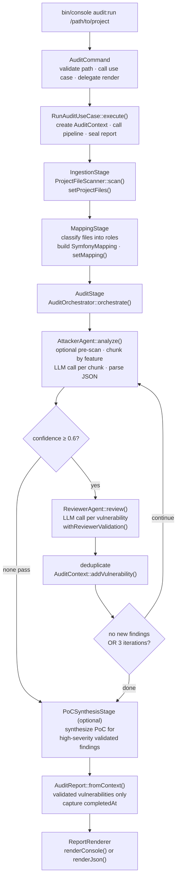

# Architecture

This document describes the internal design of the `symfony-security-auditor`
Symfony bundle for contributors and integrators. It covers layer
responsibilities, data flow, key design decisions, and extension points.

## Table of Contents

- [Layer Overview](#layer-overview)
- [Data Flow](#data-flow)
- [Domain Layer](#domain-layer)
  - [`AuditContext`](#auditcontext--mutable-pipeline-accumulator)
  - [`AuditReport`](#auditreport--immutable-final-snapshot)
  - [`Vulnerability`](#vulnerability--immutable-copy-on-write-mutations)
  - [`VulnerabilitySeverity`](#vulnerabilityseverity--backed-enum)
  - [`VulnerabilityType`](#vulnerabilitytype--backed-enum-with-owasp-references)
  - [`ProjectFile`](#projectfile--immutable-scanned-file)
  - [`SymfonyMapping`](#symfonymapping--immutable-project-structure-snapshot)
  - [Pipeline ports](#pipeline-ports-domainpipeline)
- [Application Layer](#application-layer)
  - [`RunAuditUseCase`](#runauditusecase)
  - [`AuditPipeline`](#auditpipeline)
  - [Stages](#stages)
  - [`AuditOrchestrator`](#auditorchestrator)
  - [`AttackerAgent`](#attackeragent)
  - [`ReviewerAgent`](#revieweragent)
  - [`VulnerabilityFactory`](#vulnerabilityfactory)
- [Infrastructure Layer](#infrastructure-layer)
- [Bundle Wiring](#bundle-wiring-symfonysecurityauditorbundle)
- [`Command/AuditCommand`](#commandauditcommand)
- [Extension Points](#extension-points)

> See also: [Configuration](configuration.md) · [Extending](extending.md) ·
> [FAQ](faq.md) · [Troubleshooting](troubleshooting.md)

---

## Layer Overview

The bundle follows a strict Domain-Driven Design layering under `src/Audit/`.
Infrastructure dependencies never leak into the Domain or Application layers.

```text
src/
├── Audit/
│   ├── Domain/          # Pure PHP — no framework, no I/O
│   │   ├── Model/       # Value objects and enums
│   │   ├── Pipeline/    # PipelineInterface, StageInterface, CoverageRecorderInterface, NullCoverageRecorder
│   │   └── Port/        # Cross-layer ports — LLMClientInterface,
│   │       │              BatchCapableLLMClientInterface, LLMResponse,
│   │       │              AttackerCacheInterface, ReviewerCacheInterface,
│   │       │              AdvisoryDatabaseInterface,
│   │       │              ProjectFileScannerInterface, SecretScrubberInterface,
│   │       │              TokenEstimatorInterface, RateLimiterInterface,
│   │       │              PricingProviderInterface, ProgressReporterInterface,
│   │       │              StaticPreScannerInterface, CodeSlicerInterface,
│   │       │              ControllerAccessControlParserInterface,
│   │       │              VoterCapabilityParserInterface,
│   │       │              FormBindingParserInterface,
│   │       │              GitChangedFilesResolverInterface,
│   │       │              Attacker/ReviewerPromptBuilderInterface
│   │       └── Tool/    # ToolInterface, ToolDefinition, ToolRegistry, ToolRegistryFactoryInterface
│   ├── Application/     # Orchestration — no I/O, depends only on Domain
│   │   ├── UseCase/     # Entry points: RunAuditUseCase, EstimateAuditCostUseCase
│   │   ├── Pipeline/    # AuditPipeline + Stage/{IngestionStage, MappingStage, AuditStage, PoCSynthesisStage}
│   │   └── Agent/       # AttackerAgent, ReviewerAgent, EscalatingAttackerAgent,
│   │                      AuditOrchestrator, VulnerabilityFactory,
│   │                      VulnerabilityCollector + RecordVulnerabilityToolFactoryInterface,
│   │                      ReviewCollector + RecordReviewToolFactoryInterface,
│   │                      PoCSynthesizer, Chunking/FileChunker
│   └── Infrastructure/  # I/O adapters
│       ├── LLM/         # SymfonyAiLLMClient, RetryPolicy, TransientFailureClassifier,
│       │                  CharacterBasedTokenEstimator, Delay/SleeperInterface + UsleepSleeper,
│       │                  RateLimit/{NullRateLimiter, TokenBucketRateLimiter, RetryAfterHeaderParser}
│       ├── FileSystem/  # ProjectFileScanner, RegexSecretScrubber, NullSecretScrubber
│       ├── Scan/        # RegexStaticPreScanner, RegexCodeSlicer,
│       │                  PhpParser{ControllerAccessControl, VoterCapability, FormBinding}Parser
│       │                  (+ Null* no-op twins)
│       ├── Diff/        # ProcessGitChangedFilesResolver (git diff for --since)
│       ├── Prompt/      # AttackerPromptBuilder, ReviewerPromptBuilder
│       ├── Cache/       # FilesystemAttackerCache, NullAttackerCache,
│       │                  FilesystemReviewerCache, NullReviewerCache
│       ├── Advisory/    # ComposerAuditAdvisoryDatabase (default), InMemoryAdvisoryDatabase,
│       │                  SymfonyProcessComposerAuditRunner + Exception/*
│       ├── Pricing/     # StaticPricingProvider
│       ├── Progress/    # ConsoleProgressReporter, LoggerProgressReporter,
│       │                  NullProgressReporter, ProgressReporterHolder
│       ├── Tool/        # ReadFileTool, GrepTool, ListFilesTool, LookupAdvisoryTool,
│       │                  SymfonyToolRegistryFactory, RecordVulnerabilityTool + Factory,
│       │                  RecordReviewTool + Factory
│       └── Report/      # ReportRenderer (console / JSON / SARIF + Template/*.txt)
├── Command/             # AuditCommand + AuditCommandInput, AuditPresenter, ReportWriter, AuditExitCodeResolver, OutputFormat
└── SymfonySecurityAuditorBundle.php  # Bundle class with configure() + loadExtension()
```



```mermaid
graph LR
    CMD["Command\nAuditCommand"]

    subgraph APP["Application"]
        UC["RunAuditUseCase"]
        PIPE["AuditPipeline + Stages"]
        AGENTS["AttackerAgent\nReviewerAgent"]
    end

    subgraph DOM["Domain"]
        MODELS["AuditContext · AuditReport\nVulnerability · ProjectFile\nSymfonyMapping"]
        PORTS["PipelineInterface · StageInterface\nLLMClientInterface · LLMResponse\nAttackerCacheInterface · ProjectFileScannerInterface\nSecretScrubberInterface · TokenEstimatorInterface\nPricingProviderInterface\n*PromptBuilderInterface · Tool/* (ports)"]
    end

    subgraph INFRA["Infrastructure"]
        LLM["SymfonyAiLLMClient"]
        FS["ProjectFileScanner"]
        PROMPTS["PromptBuilders"]
        CACHE["FilesystemAttackerCache · FilesystemReviewerCache\n(+ Null* twins)"]
        ADVISORY["ComposerAuditAdvisoryDatabase\nInMemoryAdvisoryDatabase\nSymfonyProcessComposerAuditRunner"]
        TOOLS["ReadFile · Grep · ListFiles · LookupAdvisory tools\nSymfonyToolRegistryFactory"]
        RENDERER["ReportRenderer"]
    end

    CMD --> APP
    APP --> DOM
    INFRA -.->|implements| DOM
    APP -->|via interface| INFRA
```

**Namespace root**: `VinceAmstoutz\SymfonySecurityAuditor\`

---

## Data Flow



---

## Domain Layer

### `AuditContext` — mutable pipeline accumulator

`AuditContext` is the single shared object threaded through every pipeline
stage. It is intentionally mutable: stages write to it; the use case reads the
final state.

```text
AuditContext {
  projectPath: string           (immutable, set at construction)
  auditId: string               (immutable, generated: AUDIT-{8hex})
  startedAt: DateTimeImmutable  (immutable, set at construction)
  projectFiles: list<ProjectFile>   (set by IngestionStage)
  mapping: SymfonyMapping|null      (set by MappingStage)
  vulnerabilities: array<id, Vulnerability>  (accumulated by AuditStage)
  metadata: array<string, mixed>    (arbitrary stage metadata)
}
```

Key computed reads:

- `validatedVulnerabilities()` — filters by `isReviewerValidated() === true`
- `criticalVulnerabilities()` — filters validated + `CRITICAL` severity
- `riskScore()` — sum of `severity->score()` over validated vulnerabilities

### `AuditReport` — immutable final snapshot

Created exactly once via `AuditReport::fromContext(AuditContext)` after the
pipeline finishes. It captures only `validatedVulnerabilities()` — unvalidated
attacker findings are discarded.

```text
AuditReport {
  auditId, projectPath, startedAt, completedAt, filesScanned
  vulnerabilities: list<Vulnerability>   (validated only)
}
```

Computed methods: `riskScore()`, `riskLevel()` (SAFE / LOW / MEDIUM / HIGH /
CRITICAL), `durationSeconds()`, `vulnerabilitiesBySeverity()`,
`vulnerabilitiesByType()`, `toArray()`.

Risk level thresholds (based on summed severity scores):

| Score | Level    |
| ----- | -------- |
| >= 50 | CRITICAL |
| >= 30 | HIGH     |
| >= 15 | MEDIUM   |
| >= 5  | LOW      |
| < 5   | SAFE     |

### `Vulnerability` — immutable, copy-on-write mutations

All properties are `readonly`. State changes return new instances:

- `withReviewerValidation(bool): self` — called by `ReviewerAgent`
- `withElevatedSeverity(VulnerabilitySeverity): self` — called when reviewer
  adjusts severity

The `id` is deterministic:
`VULN-{sha1(type+filePath+lineStart+microtime)[0..7]}`.

Fields: `id`, `type` (enum), `severity` (enum), `title`, `description`,
`filePath`, `lineStart`, `lineEnd`, `vulnerableCode`, `attackVector`, `proof`,
`remediation`, `confidence` (0.0–1.0), `reviewerValidated`, `detectedAt`.

### `VulnerabilitySeverity` — backed enum

| Case     | Score | `isExploitable()` |
| -------- | ----- | ----------------- |
| CRITICAL | 10    | true              |
| HIGH     | 7     | true              |
| MEDIUM   | 5     | false             |
| LOW      | 2     | false             |
| INFO     | 0     | false             |

`score()` drives the risk calculation. `isExploitable()` is used by
`Vulnerability::isHighRisk()`.

### `VulnerabilityType` — backed enum with OWASP references

32 cases in six categories:

| Category              | Examples                                                                   |
| --------------------- | -------------------------------------------------------------------------- |
| Injection             | `SQL_INJECTION`, `COMMAND_INJECTION`, `TWIG_INJECTION`, …                  |
| Broken Access Control | `BROKEN_ACCESS_CONTROL`, `MISSING_VOTER`, `MISSING_CSRF_PROTECTION`, …     |
| Logic Flaw            | `BUSINESS_LOGIC_FLAW`, `RACE_CONDITION`, `STATE_MACHINE_BYPASS`, …         |
| Symfony-Specific      | `MASS_ASSIGNMENT`, `UNSAFE_PARAMETER_BINDING`, `MISCONFIGURED_FIREWALL`, … |
| Data Exposure         | `SENSITIVE_DATA_EXPOSURE`, `PATH_TRAVERSAL`, `SSRF`, `XXE`, …              |
| Cryptographic         | `WEAK_CRYPTOGRAPHY`, `HARDCODED_SECRET`, `INSECURE_RANDOM`                 |

`category()` and `owaspReference()` return human-readable strings used in report
output and LLM prompts.

### `ProjectFile` — immutable scanned file

Holds `relativePath`, `absolutePath`, `content`, a `ProjectFileType` enum case,
and `linesCount`. `type()` returns the enum's string value (stable wire format);
`fileType()` returns the typed `ProjectFileType` case. Classification methods
(`isController()`, `isEntity()`, `isVoter()`, `isRepository()`, `isForm()`,
`isService()`, `isTemplate()`, `isConfiguration()`) drive both `SymfonyMapping`
construction and `AttackerAgent` chunking priority. `ProjectFileType` is the
single source of truth for the file-type vocabulary, referenced by the chunker,
the static pre-scanner buckets, and the attacker skill-block ordering.

### `SymfonyMapping` — immutable project structure snapshot

Groups `ProjectFile` instances by role and holds `routeAccessMap` and
`firewallRules`. Passed to `AttackerAgent` so it can reason about the full
security surface rather than file contents alone. Notable helpers:

- `controllersWithoutVoters()` surfaces controllers that lack `#[IsGranted]` or
  `denyAccessUnlessGranted` calls (filename-heuristic).
- `routeAccessControls()` returns the route → controller graph: one
  `RouteAccessControl` per public action with its parsed `#[Route]`, class- and
  method-level `#[IsGranted]`, and `denyAccessUnlessGranted()` call sites.
- `controllersWithoutAccessCheck()` filters the graph to actions that carry a
  route but no enforcement.

### `RouteAccessControl` — immutable per-action access-control summary

One entry per public controller action emitted by
`ControllerAccessControlParserInterface` (default impl
`PhpParserControllerAccessControlParser`, AST-based via `nikic/php-parser`).
Captures `filePath`, `methodName`, `routePath`, `routeMethods`, plus three
boolean / list signals — `methodLevelIsGranted`, `methodHasDenyAccess`,
`classHasIsGranted` — combined by `hasAccessCheck()` and `lacksAccessCheck()`.
The attacker prompt renders the full graph as a `Route Access-Control Map` block
so the LLM can spot missing enforcement without re-deriving it from source.

### `VoterCapability` — immutable per-voter `supports()` summary

One entry per voter file emitted by `VoterCapabilityParserInterface` (default
impl `PhpParserVoterCapabilityParser`). Captures `filePath`, `className`,
`supportedAttributes` (string literals seen inside `supports()`) and
`supportedSubjects` (right-hand class names of `instanceof` checks). Helpers
`coversAttribute(string)` and `coversSubject(string)` answer "is there a voter
that handles this access decision?" so the prompt's `Voter Coverage` block lets
the LLM flag `#[IsGranted('ATTR', $subject)]` calls that no voter actually
backs.

### `FormBinding` — immutable controller → form-type binding

One entry per `$this->createForm(SomeFormType::class)` call site emitted by
`FormBindingParserInterface` (default impl `PhpParserFormBindingParser`).
Captures `controllerFilePath`, `controllerMethod`, and `formTypeClass`. The
attacker prompt renders the list as a `Form Bindings` block so the LLM can
cross-reference call sites against the form types involved for mass-assignment /
CSRF analysis without re-deriving the binding from source.

### Pipeline ports (`Domain/Pipeline/`)

- `PipelineInterface::process(AuditContext): void`
- `StageInterface::process(AuditContext): void` + `name(): string`

Both are pure domain ports. Concrete implementations live in
`Application/Pipeline/`.

---

## Application Layer

### `RunAuditUseCase`

Single public method: `execute(string $projectPath): AuditReport`. Owns the
lifecycle: creates `AuditContext`, delegates to `AuditPipeline`, seals
`AuditReport`. No I/O, no LLM calls — those are behind interfaces injected into
the stages.

### `AuditPipeline`

Ordered stage container. Stages are added via `addStage(StageInterface)` (wired
by the extension). Logs stage name and elapsed time per stage.

### Stages

**`IngestionStage`** — calls `ProjectFileScanner::scan(string $projectPath)`,
calls `AuditContext::setProjectFiles()`.

**`MappingStage`** — classifies `AuditContext::projectFiles()` into roles,
constructs `SymfonyMapping`, calls `AuditContext::setMapping()`. May use the LLM
client for semantic mapping or fall back to heuristic classification.

**`AuditStage`** — delegates entirely to
`AuditOrchestrator::orchestrate(AuditContext)`.

**`PoCSynthesisStage`** — optional final stage (off by default). When enabled,
synthesizes a concrete reproduction artifact (the `synthesized_poc` report
field) for validated findings at or above the configured severity floor,
delegating to `PoCSynthesizer`.

### `AuditOrchestrator`

Implements the attacker-vs-reviewer loop:


Duplicate detection: two vulnerabilities are duplicates when their IDs match, or
when `filePath`, `type`, and line ranges all overlap.

### `AttackerAgent`

Sorts files by security priority before chunking:

| Priority | File type       |
| -------- | --------------- |
| 0        | Controllers     |
| 1        | Voters          |
| 2        | Entities        |
| 3        | Repositories    |
| 4        | Forms           |
| 5        | Everything else |

`analyze()` takes an immutable `AttackerAnalysisRequest` (files, mapping,
`bypassCache`, `previousFindings`, `rejectedFindings`) plus a
`CoverageRecorderInterface`. The chunk-priority ordering above is defined once
on `FileChunker` over `ProjectFileType` cases. Risk markers are indexed by
`RiskMarkerIndex`, and the deterministic-marker / prior-findings prompt
preambles are rendered by `AttackerContextPromptRenderer`.

Chunks the files (default `feature` strategy; `type` for the legacy
priority-window). For each chunk: builds prompts via `AttackerPromptBuilder`,
then either calls `LLMClientInterface::complete()` (single-shot) or
`LLMClientInterface::completeWithTools()` (tool-using loop) depending on
`audit.tools_enabled`. With tools enabled, the attacker can call `read_file`,
`grep`, `list_files`, and `lookup_advisory` for cross-file investigation,
bounded by `audit.max_tool_iterations`. JSON output is parsed via
`LLMResponse::parseJson()` and hydrated via `VulnerabilityFactory::fromList()`.
LLM or JSON errors are caught and logged; the chunk returns an empty array
rather than propagating.

Identical chunks (same content hash) are short-circuited by
`AttackerCacheInterface` (`FilesystemAttackerCache` by default,
`NullAttackerCache` when `cache.enabled: false`).

### `ReviewerAgent`

Reviews vulnerabilities one at a time (or in batches when `batchSize > 1`). For
each: builds context from the source file content, calls
`LLMClientInterface::complete()`, parses `accepted` (bool), `adjusted_severity`
(optional string) and `corrected_type` (optional string) from the JSON response,
returns a new `Vulnerability` instance via copy-on-write
(`withReviewerValidation` / `withElevatedSeverity` / `withCorrectedType`). On
any error: returns the vulnerability with `reviewerValidated = false`.

With `audit.reviewer_structured_collection: true`, the reviewer instead records
each verdict by calling a schema-enforced `record_review` tool — mirroring the
attacker's `record_vulnerability` seam — and verdicts are drained from a
`ReviewCollector`. In this mode the tool replaces the reviewer's cross-file
tools (`reviewer_tools_enabled`) and the concurrent fast path
(`reviewer_max_concurrent`).

In the sequential one-finding-per-call mode (the default), verdicts for findings
with identical content against unchanged code are short-circuited by
`ReviewerCacheInterface` (`FilesystemReviewerCache` by default,
`NullReviewerCache` when `cache.enabled: false`), mirroring the attacker cache.
Batched, concurrent, and structured-collection reviews always call the LLM.
`--no-cache` bypasses both caches for the run.

### `VulnerabilityFactory`

Parses raw `array<string, mixed>` from LLM JSON output into `Vulnerability`
instances. Each entry is first checked against `symfony/validator` constraints
(non-blank `title` / `description` / `file_path`, sane length bounds on every
free-text field); on violation the entry is dropped under
`VulnerabilityDropReason::VALIDATION_FAILED`. Surviving entries are hydrated;
invalid or missing fields are handled with null-coalescing casts; invalid enum
values cause a caught `\Throwable` and the entry is dropped under
`VulnerabilityDropReason::HYDRATION_FAILED`. Non-array list entries are dropped
under `VulnerabilityDropReason::NON_ARRAY_ENTRY`.

`fromArray()` still returns `?Vulnerability`. `fromList()` returns a
`VulnerabilityHydrationResult` value object exposing both the hydrated
vulnerabilities and per-reason drop counts. `AttackerAgent::analyze` aggregates
the per-chunk drop counts and surfaces them on its `Attacker agent complete`
info log as `total_dropped_entries` / `dropped_by_reason`.

---

## Infrastructure Layer

### `LLMClientInterface`

```php
interface LLMClientInterface
{
    public function complete(string $systemPrompt, string $userMessage): LLMResponse;

    public function completeWithTools(
        string $systemPrompt,
        string $userMessage,
        ToolRegistry $toolRegistry,
        int $maxToolIterations,
    ): LLMResponse;

    public function model(): string;
}
```

This is the sole seam between Application and LLM I/O. Application agents never
import any `symfony/ai` type. `LLMClientInterface` and `LLMResponse` live under
`Audit\Domain\Port\`; tool ports live under `Audit\Domain\Port\Tool\`.

### `SymfonyAiLLMClient`

Adapter implementing `LLMClientInterface`. Wraps
`Symfony\AI\Agent\AgentInterface` (from `symfony/ai`). Builds a `MessageBag`
with a system message and a user message per call, invokes
`$agent->call($messages, ['stream' => false])`, and wraps the string result in
`LLMResponse`.

Token usage (input, output tokens) is read from the platform response via
`symfony/ai`'s `TokenUsageInterface` and forwarded to the shared
`TokenUsageRecorder` so `RunAuditUseCase` can attribute cumulative usage to the
final `AuditReport`. `BudgetTracker` receives the same counts to enforce
`audit.budget.*` limits; it throws `BudgetExceededException` when a limit is
breached, triggering a clean abort with exit code `2`.

Jittered exponential backoff is applied by the surrounding `RetryPolicy`;
transient failures (HTTP 429, 5xx) are retried up to `audit.retry.max_attempts`
times. Non-transient failures (auth, validation errors) are classified by
`TransientFailureClassifier` and propagate immediately. Eager resolution of the
`DeferredResult` (forcing `getResult()` before the retry wrapper exits) ensures
errors emitted by `symfony/http-client`'s lazy body read surface inside the
retry loop instead of escaping later in `complete()` / `completeWithTools()`.

Around each invocation, `RateLimiterInterface` (default `NullRateLimiter`,
opt-in `TokenBucketRateLimiter`) gates outbound calls proactively:
`acquire($estimatedInputTokens)` blocks until the next request fits inside the
configured per-minute windows, `record($in, $out)` reconciles the estimate with
actuals once the call completes, and `pauseUntil($at)` propagates a
server-issued `Retry-After` (parsed by `RetryAfterHeaderParser` from
`Symfony\AI\Platform\Exception\RateLimitExceededException::getRetryAfter()`) so
concurrent chunks share the freeze instead of stampeding the provider.

Swapping LLM providers (Anthropic → OpenAI → Mistral → Ollama → …) requires no
code changes — only `ai.yaml` configuration.

### `LLMResponse`

Thin value object wrapping the raw string content. Key method: `parseJson()`
strips markdown code fences that models sometimes emit, then JSON-decodes.
Throws `\JsonException` on invalid JSON, `\RuntimeException` when the decoded
value is not an array. `isEmpty()` checks for blank content.

### `ProjectFileScanner`

Walks a project directory, reads `.php`, `.twig`, `.yaml`, `.yml`, `.xml` files,
constructs `ProjectFile` instances with relative paths (relative to the scanned
root).

### `AttackerPromptBuilder` / `ReviewerPromptBuilder`

Build system and user prompts fed to `LLMClientInterface::complete()`. Both are
pure string builders with no network or I/O dependencies.

The attacker prompt has two modes selected by `audit.structured_collection`:

- **`true` (default)** — the prompt instructs the model to record findings via
  the `record_vulnerability` tool, one call per finding. The tool's input schema
  mirrors the `Vulnerability` shape and the provider validates each call before
  the agent ever sees it, so bare-string and wrapper-object drift is
  structurally impossible.
- **`false`** — the prompt instructs the model to output a JSON array of
  vulnerability objects matching `VulnerabilityFactory::fromArray()`'s expected
  keys. The tightened rules block forbids non-object array elements,
  environment-keyed wrapper objects, and bare environment-name strings; the
  `VulnerabilityFactory` then validates each entry with `symfony/validator`
  before hydration.

Both modes share the same intro, severity/confidence rubrics, file-numbering
protocol, scope guidance, single few-shot example, and — when files of the
corresponding `ProjectFile` type appear in the chunk — per-artifact skill blocks
(controller, voter, form, repository, entity, template, config, php). Skill
blocks emit both attack patterns to hunt and patterns explicitly NOT to flag,
reducing reviewer noise. Blocks are emitted in attack-surface priority order,
not alphabetically.

Source files are wrapped as `<file path="…" type="…">…</file>` and every line is
prefixed with a line-number marker of the form `` `NNN | ` `` (line number,
space, pipe, space). The model is instructed to populate `line_start` /
`line_end` using those exact numbers rather than counting manually.

The reviewer prompt expects each entry of the JSON array to be shaped:

```json
{
  "id": "string",
  "accepted": true,
  "adjusted_severity": "critical|high|medium|low|info|null",
  "corrected_type": "<vulnerability_type>|null",
  "reviewer_notes": "string",
  "additional_attack_paths": "string|null"
}
```

With `audit.reviewer_structured_collection: true`, the same fields are recorded
through the schema-enforced `record_review` tool instead (`id` and `accepted`
required, the enums constrained by the schema), so the provider validates every
verdict before the agent sees it.

It includes a Symfony-specific false-positive playbook (Doctrine
`setParameter()`, default CSRF, `mapped: false`, hardcoded-argv `Process`, etc.)
so the reviewer rejects known non-issues with a one-line note. The single- and
batch-mode system prompts share a single core-instructions block to prevent
drift.

### `ReportRenderer`

Three render methods:

- `renderConsole(AuditReport): string` — human-readable terminal output
- `renderJson(AuditReport): string` — delegates to `AuditReport::toArray()` then
  `json_encode`
- `renderSarif(AuditReport): string` — SARIF 2.1.0; `tool.driver.version`
  sourced dynamically from installed Composer metadata

---

## Bundle Wiring (`SymfonySecurityAuditorBundle`)

### `SymfonySecurityAuditorBundle`

Extends `AbstractBundle`. All wiring lives directly in this class — no separate
Extension or Configuration class.

`configure(DefinitionConfigurator $definition)` defines the config tree under
root key `symfony_security_auditor`. Top-level scalars:

| Key              | Default             | Purpose                                         |
| ---------------- | ------------------- | ----------------------------------------------- |
| `model`          | `'claude-opus-4-7'` | Model name for both Attacker and Reviewer roles |
| `attacker_model` | `null`              | Override: dedicated model for the Attacker role |
| `reviewer_model` | `null`              | Override: dedicated model for the Reviewer role |

Nested sections:

- `scan.*` — `included_paths`, `respect_gitignore`, `max_file_size_kb`,
  `secret_scrubbing.enabled`, `secret_scrubbing.additional_patterns` (file
  discovery + credential redaction)
- `audit.*` — `max_iterations`, `min_confidence`, `reviewer_batch_size`,
  `tools_enabled`, `max_tool_iterations` (orchestrator knobs);
  `budget.max_tokens`, `budget.max_cost_usd` (abort limits);
  `retry.max_attempts`, `retry.initial_delay_ms`, `retry.backoff_multiplier`,
  `retry.jitter_ratio` (LLM resilience)
- `cache.*` — `enabled`, `dir` (chunk cache). `prompt_caching` is deprecated
  since 1.7 and ignored; provider-side prompt caching is configured on the
  `symfony/ai` platform (`cache_retention` in `ai.yaml` for Anthropic; automatic
  for OpenAI/Gemini).

Model names must be supported by the platform configured in
`config/packages/ai.yaml`. See [`docs/configuration.md`](configuration.md) for
the full reference.

Minimal configuration:

```yaml
symfony_security_auditor:
    model: 'claude-opus-4-7'
```

Split-model configuration (larger model for attacking, faster for reviewing):

```yaml
symfony_security_auditor:
    attacker_model: 'claude-opus-4-7'
    reviewer_model: 'claude-haiku-4-5-20251001'
```

Corresponding `ai.yaml` (platform only — no agent config needed):

```yaml
ai:
    platform:
        anthropic:
            api_key: '%env(ANTHROPIC_API_KEY)%'
```

The `loadExtension()` method (receiving `$config`, `ContainerConfigurator`,
`ContainerBuilder`) imports `config/services.php`, then registers two
`SymfonyAiLLMClient` service definitions (`security_auditor.attacker_client` and
`security_auditor.reviewer_client`). Each receives `PlatformInterface`, the
resolved model name (`attacker_model` or `reviewer_model`, falling back to
`model`) and the default temperature, so `AttackerAgent` and `ReviewerAgent`
each receive the correct client. Sets `LLMClientInterface::class` as a private
alias to the attacker client.

`AttackerCacheInterface` is aliased to `FilesystemAttackerCache` when
`cache.enabled: true`, otherwise to `NullAttackerCache`.
`AdvisoryDatabaseInterface` is aliased to `ComposerAuditAdvisoryDatabase` (the
default backed by `composer audit --format=json --locked`).

Parameters exposed for debugging: `symfony_security_auditor.attacker_model`,
`symfony_security_auditor.reviewer_model`, and the matching `scan.*`, `audit.*`,
`cache.*` parameters.

---

## `Command/AuditCommand`

Console command `audit:run`. Arguments and options:

| Name            | Type     | Default    | Purpose                                           |
| --------------- | -------- | ---------- | ------------------------------------------------- |
| `project-path`  | argument | `getcwd()` | Path to target project; defaults to CWD           |
| `--format / -f` | option   | `console`  | `console`, `json`, or `sarif`                     |
| `--output / -o` | option   | `null`     | Write JSON/SARIF report to file                   |
| `--dry-run`     | option   | `false`    | Estimate cost without invoking the LLM; exits `0` |

Input mapping and resolution live in `AuditCommandInput`; output writing in
`ReportWriter`; user-facing messaging in `AuditPresenter`; exit code policy in
`AuditExitCodeResolver`. `AuditCommand` itself only orchestrates.

Exit codes: `0` (SAFE/LOW/MEDIUM/HIGH), `1` (CRITICAL risk or invalid path or
unexpected failure), `2` (budget exceeded — partial report still emitted).

---

## Extension Points

**Add a new pipeline stage** — implement `StageInterface`, register it as a
service, inject it into the pipeline via the bundle extension. Stages process
`AuditContext` sequentially in registration order.

**Swap the LLM provider** — change `ai.yaml` only. `SymfonyAiLLMClient` is
provider-agnostic.

**Use a custom LLM client** — implement `LLMClientInterface` and alias it for
`LLMClientInterface::class`. The Application layer has no other dependency on
`symfony/ai`.

**Add new vulnerability types** — add a case to `VulnerabilityType`, add a
branch in `category()` and `owaspReference()`. The factory, agents, and report
serialization require no changes.

**Add new severity levels** — add a case to `VulnerabilitySeverity` with
`score()`, `label()`, `isExploitable()` implementations, and update the
`riskLevel()` thresholds in `AuditReport` accordingly.

**Custom report format** — add a case to `Command\OutputFormat`, add a `render*`
method to `ReportRenderer`, and add the matching `match` arm in `ReportWriter`.

**Replace advisory source** — implement
`Audit\Domain\Port\AdvisoryDatabaseInterface` and override the alias in
`config/services.yaml` to wire a custom CVE feed (Snyk, internal database, …).

**Add cross-file investigation tools** — implement
`Audit\Domain\Port\Tool\ToolInterface`, register it as a service, and inject it
into `SymfonyToolRegistryFactory` so the attacker can call it when
`audit.tools_enabled: true`.

**Replace credential scrubber** — implement
`Audit\Domain\Port\SecretScrubberInterface` and alias it in
`config/services.yaml`. Default: `RegexSecretScrubber`; disabled:
`NullSecretScrubber`.

**Replace token estimator** — implement
`Audit\Domain\Port\TokenEstimatorInterface` to plug in a provider-specific token
counter. Default: `CharacterBasedTokenEstimator` (character ÷ 4 heuristic via
`mb_strlen`).

**Replace pricing provider** — implement
`Audit\Domain\Port\PricingProviderInterface` to supply custom per-token prices.
Default: `StaticPricingProvider` (hardcoded table).
