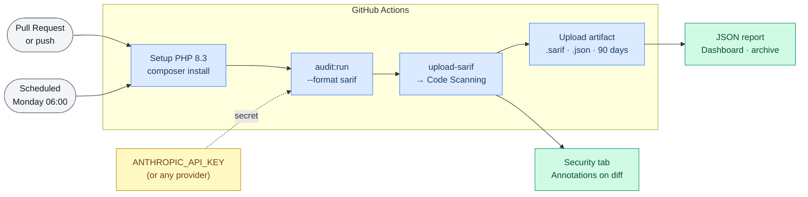
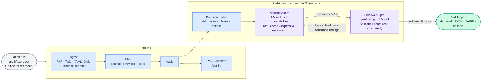
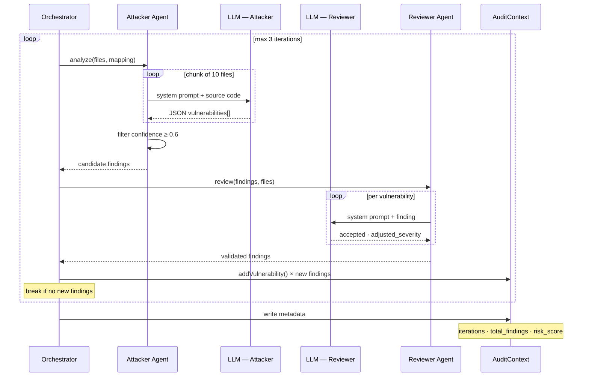

# Presentation Diagrams

## CI / CD Integration

```mermaid
%%{init: {'theme': 'default', 'themeVariables': {'background': 'transparent'}}}%%
flowchart LR
    classDef trigger fill:#f3f4f6,stroke:#6b7280,color:#111827
    classDef step fill:#dbeafe,stroke:#3b82f6,color:#1e3a5f
    classDef output fill:#d1fae5,stroke:#059669,color:#064e3b
    classDef secret fill:#fef9c3,stroke:#ca8a04,color:#713f12

    PR(["Pull Request\nor push"]):::trigger
    SCHED(["Scheduled\nMonday 06:00"]):::trigger

    subgraph GHA["  GitHub Actions  "]
        direction TB
        PHP["Setup PHP 8.3\ncomposer install"]:::step
        AUDIT["audit:run\n--format sarif"]:::step
        UPLOAD["upload-sarif\n→ Code Scanning"]:::step
        ARTIFACT["Upload artifact\n.sarif · .json · 90 days"]:::step
        PHP --> AUDIT --> UPLOAD --> ARTIFACT
    end

    KEY["ANTHROPIC_API_KEY\n(or any provider)"]:::secret

    SARIF["Security tab\nAnnotations on diff"]:::output
    JSON["JSON report\nDashboard · archive"]:::output

    PR & SCHED --> PHP
    KEY -.->|secret| AUDIT
    UPLOAD --> SARIF
    ARTIFACT --> JSON
```

## Full Pipeline

```mermaid
%%{init: {'theme': 'default', 'themeVariables': {'background': 'transparent'}}}%%
flowchart LR
    classDef cmd fill:#f3f4f6,stroke:#6b7280,color:#111827
    classDef stage fill:#dbeafe,stroke:#3b82f6,color:#1e3a5f
    classDef agent fill:#ede9fe,stroke:#7c3aed,color:#3b0764
    classDef report fill:#d1fae5,stroke:#059669,color:#064e3b

    CLI(["audit:run\n/path/to/project\n(--since for diff mode)"]):::cmd

    subgraph PIPE["  Pipeline  "]
        ING["Ingest\nPHP · Twig · YAML · XML\n(--since git diff filter)"]:::stage
        MAP["Map\nRoutes · Firewalls · Roles"]:::stage
        AUD["Audit"]:::stage
        POC["PoC Synthesis\n(opt-in)"]:::stage
        ING --> MAP --> AUD --> POC
    end

    subgraph LOOP["  Dual-Agent Loop — max 3 iterations  "]
        PRE["Pre-scan + slice\nrisk markers · feature chunks"]:::stage
        ATK["Attacker Agent\nLLM call · find vulnerabilities\n(opt. cheap→expensive escalation)"]:::agent
        REV["Reviewer Agent\nper-finding · LLM call\nvalidate + score (opt. concurrent)"]:::agent
        PRE --> ATK
        ATK -- "confidence ≥ 0.6" --> REV
        REV -. "iterate: feed back confirmed findings" .-> ATK
    end

    RPT(["AuditReport\nrisk level · JSON · SARIF · console"]):::report

    CLI --> PIPE
    AUD --> PRE
    REV -- "validated findings" --> RPT
```

## Attacker vs Reviewer — Dual-Agent Loop

```mermaid
%%{init: {'theme': 'default', 'themeVariables': {'background': 'transparent'}}}%%
sequenceDiagram
    participant O as Orchestrator
    participant A as Attacker Agent
    participant L1 as LLM — Attacker
    participant L2 as LLM — Reviewer
    participant R as Reviewer Agent
    participant C as AuditContext

    loop max 3 iterations
        O->>A: analyze(files, mapping)
        loop chunk of 10 files
            A->>L1: system prompt + source code
            L1-->>A: JSON vulnerabilities[]
        end
        A->>A: filter confidence ≥ 0.6
        A-->>O: candidate findings

        O->>R: review(findings, files)
        loop per vulnerability
            R->>L2: system prompt + finding
            L2-->>R: accepted · adjusted_severity
        end
        R-->>O: validated findings

        O->>C: addVulnerability() × new findings
        note over O: break if no new findings
    end

    O->>C: write metadata
    note over C: iterations · total_findings · risk_score
```

## Multi-Provider LLM Support

```mermaid
%%{init: {'theme': 'default', 'themeVariables': {'background': 'transparent'}}}%%
flowchart LR
    classDef agent fill:#dbeafe,stroke:#3b82f6,color:#1e3a5f
    classDef iface fill:#ede9fe,stroke:#7c3aed,color:#3b0764,font-weight:bold
    classDef adapter fill:#e0f2fe,stroke:#0284c7,color:#0c4a6e
    classDef provider fill:#f5f5f4,stroke:#78716c,color:#292524
    classDef cfg fill:#d1fae5,stroke:#059669,color:#064e3b
    classDef plug fill:#fff7ed,stroke:#f97316,color:#7c2d12

    subgraph AGENTS[" "]
        direction TB
        ATK["Attacker Agent"]:::agent
        REV["Reviewer Agent"]:::agent
    end

    IFACE["LLMClientInterface\ncomplete(system, user) · model()"]:::iface
    ADAPTER["SymfonyAiLLMClient"]:::adapter
    CFG["ai.yaml\n2 lines to swap"]:::cfg
    PLUG(["symfony/ai\nplug any provider"]):::plug

    subgraph PROVS[" "]
        direction TB
        P1["Anthropic"]:::provider
        P2["OpenAI"]:::provider
        P3["Google"]:::provider
        P4["Ollama (local)"]:::provider
        P5["Mistral, Azure, AWS Bedrock …"]:::provider
    end

    AGENTS --> IFACE --> ADAPTER --> PLUG --> PROVS
    CFG -.->|configure| ADAPTER
```
